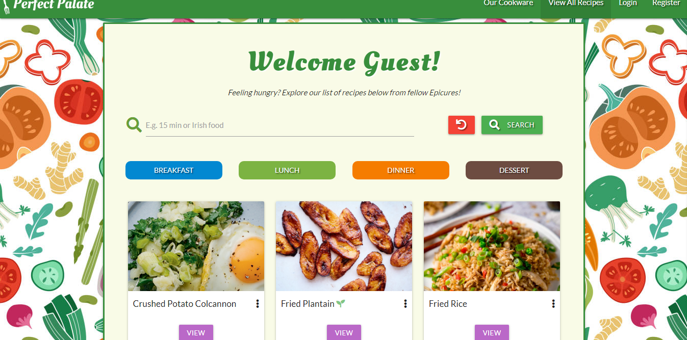
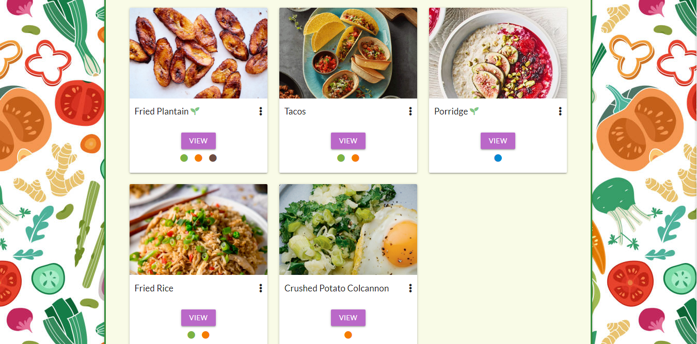
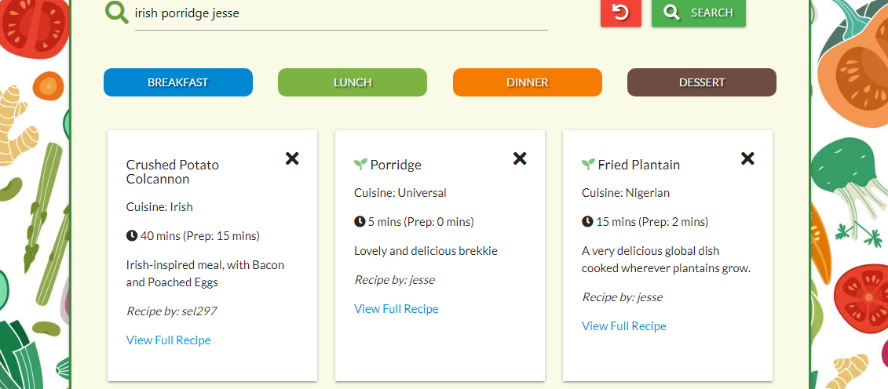
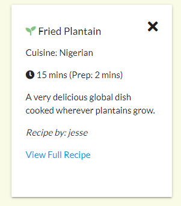
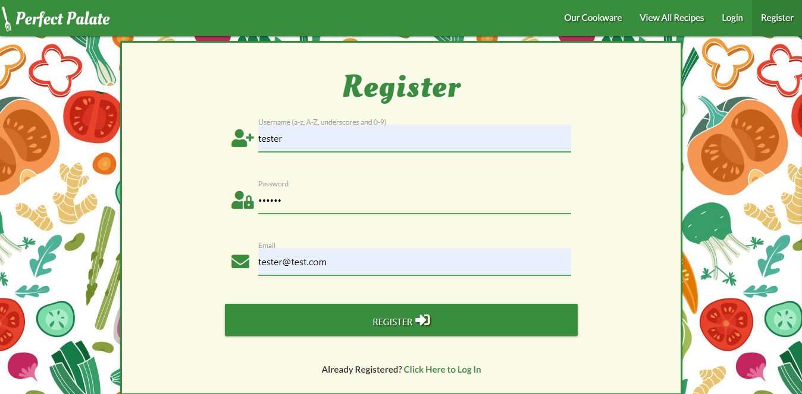
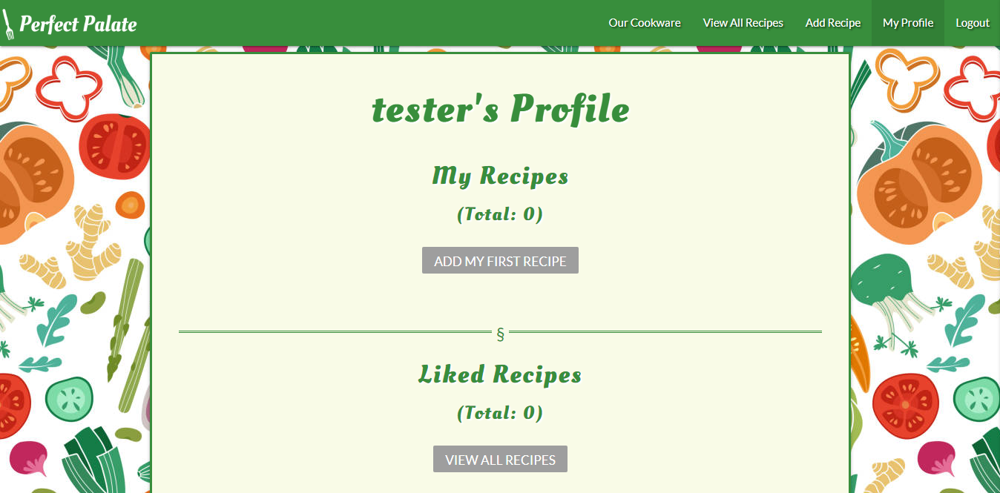
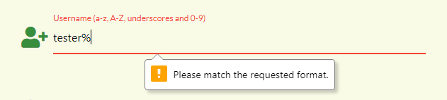
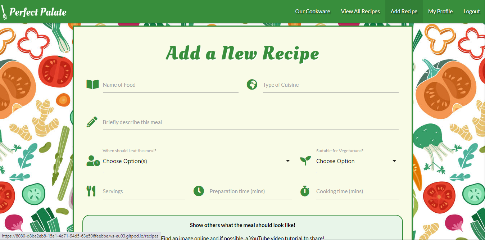
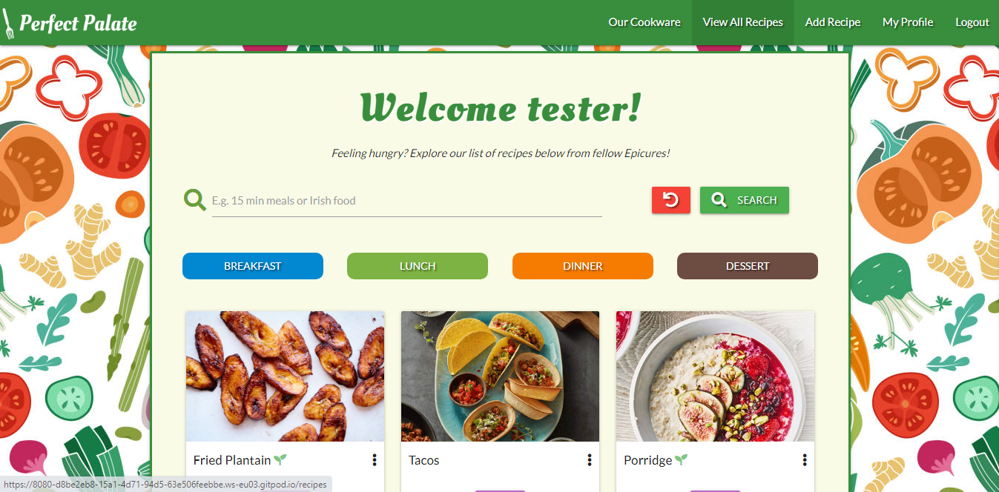
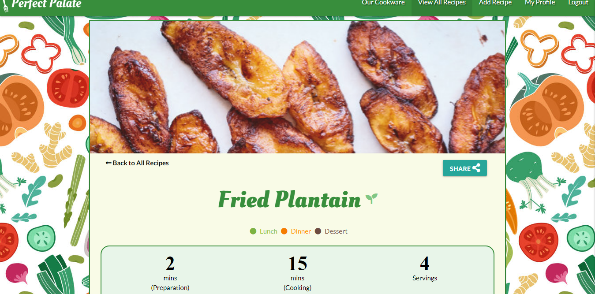

# Perfect Palate

## 1. User Experience - UX

### 1.1. User Stories

### 1.2. Structure and Skeleton Phases

## 2. Features

### 2.1. General Features

### 2.2. CRUD Functionalities

2.2.1. Create

2.2.2. Read
search bar: The search index includes the recipe_name, recipe_by, cuisine_type, meal_time, cooking_time and description. Users can search for recipes submitted by a certain user by simply typing their name; the function will filter accordingly. It is important to note that Perfect Palate uses the default behaviour of a searching index, which is "OR" rather than "AND". 

For example, searching for "irish porridge jesse" will filter all recipes that include any of those keywords in their recipe object. See 

2.2.3. Update

2.2.4. Delete

### 2.3. Special Features

### 2.4. Features Left to Implement
- Like Button

- S3 Bucket

- Carousel/Pagination for cards

- More Filters

- Forgot Password

## 3. Technologies Used

- [Git](https://git-scm.com/) - Perfect Palate used Git as the version control system during its development.

- [GitPod](https://www.gitpod.io/) - An online Integrated Development Environment (IDE) for writing and running code.

- [HTML5](https://en.wikipedia.org/wiki/HTML5) - HTML stands for Hypertext Markup Language and it is the backbone of Perfect Palate. The latest version (HTML5) - was used to add and structure the site content.

- [CSS3](https://en.wikipedia.org/wiki/Cascading_Style_Sheets) - CSS stands for Cascading Style Sheets. The latest version (CSS3) was used to style all HTML content on the website for enhanced structure and visual appeal.

- [Materialize CSS](https://materializecss.com/) - A UI component library with a grid system that Perfect Palate uses to layout site content in a structured fashion. The framework also provides some assistance to styling with class names.

- [Google Fonts](https://fonts.google.com/) - This font library offers a wide variety of font styles to help with the Perfect Palate's brand. This project uses Oleo and Lato fonts.

- [Font Awesome](https://fontawesome.com/) - Perfect Palate uses this icon library with its great selection of icons, to improve user experience (UX).

- [JavaScript](https://www.javascript.com) - onclick functionality to print full recipe or save as PDF.

- [JQuery](https://jquery.com/) - Perfect Palate uses the JQuery Framework in its script. It also assists Materialize functionalities by initializing them e.g. the loading of modal forms.

- [Python](https://www.python.org/) - General-purpose coding language used to render Perfect Palate's templates and run backend functionalities including wiring to database on MongoDB.

- [Flask](https://flask.palletsprojects.com/en/1.1.x/) - Micro-web framework written in Python. Perfect Palate uses this to write the python app functions and app routes.

- [Jinja](https://jinja.palletsprojects.com/en/2.11.x/) - A web template engine. Perfect Palate uses this to unpack the requested data retrieved from MongoDB in the HTML templates.

- [Pytest](https://docs.pytest.org/en/stable/) - Testing framework used for writing test codes in python to help refactor code in the Perfect Palate app.

- [Werkzeug](https://werkzeug.palletsprojects.com/en/1.0.x/) - Used to generate and check password hashes for extra security as user data is submitted to the database from the Perfect Palate Login and Register pages.

- [MongoDB](https://www.mongodb.com/) - A non-relational (NoSQL) source-available cross-platform document-oriented database program used to store data submitted from Perfect Palate. 

- [Balsamiq](https://balsamiq.com/) - Used to construct Perfect Palate's wireframes in the skeleton phase of UX.

- [MindMup](https://www.mindmup.com/) - Used to brainstorm ideas in the conceptual phase of Perfect Palate's project development.

## 4. Testing

### 4.1. Manual Testing of Features

The Perfect Palate website was designed to give users the ability to find recipes and share them on their socials. Users that have registered an account, have the privilege of creating, editing and deleting their own recipes whenever they choose. In order to demonstrate the full manual testing of these features, I will create an account, login and then perform the CRUD functionalities.

This manual testing was performed using the Google Chrome web browser.

4.1.1. Features Before Registering

- On first arrival of the Perfect Palate website, the user will be greeted and referred to as "Guest" on the _View All Recipes_ page: 

- At this point, the user will only be able to find and read recipes via the view buttons: 

- Use the search bar to search for keywords, by typing words and then pressing the search button. In this test, "irish porridge jesse" is searched. All recipes containing the keywords "irish", "porridge" and "jesse" in the index as described in section 2.1 will be displayed: 
 

- Click on the "Fried Plantain" card image to reveal a summary of the recipe: 

4.1.2. Register account
- Click _Register_ at the top right of the navigation bar, then the following page will load: 

- For the purpose of this test, I created an account with username of "tester" as shown in the above image. When successfully registered, the user will be redirected to their profile page: 

- Another user cannot create an account with the same email or username that "tester" used: 
 

- User will only be able to create account using any of the characters displayed on the label: 

4.1.3. Login

- If user inputs either an incorrect username or password, the following flash message will be shown: 

- Similarly with registration, if successfully logged in, user will be redirected to their profile page.

4.1.4. Create (CRUD Functionalities)

- Click _Add New Recipe_ on the navigation bar: 

- Fill in all fields. (The YouTube link is not compulsory and can be left blank)

4.1.5. Read (CRUD Functionalities)

- To view all recipes on the website, click _View All Recipes_ on the navigation bar. The menu items have now changed to display options relevant to a registered user namely: _Logout_, _My Profile_ and _Add Recipe_. The page displayed is now as follows: 

- To view other users' individual recipes, click on the view button of the desired recipe card. For this test, "tester" has chosen to view the recipe for "Fried Plantain": 

4.1.6. Update (CRUD Functionalities)

4.1.7. Delete (CRUD Functionalities)

### 4.2. Automated Testing

### 4.3. Achievement of User Stories

### 4.4. Code Validation

### 4.5. Test on Different Browsers

The table below, summarizes the website's versatility and compability across the different type of browsers; which any user could use.

Key: &#x2714; = Website functions as intended

|    Browser (Version)   | Our Cookware | View All Recipes + Full Recipe | Add/Edit Recipe | My Profile |   Login  | Register |
|:----------------------:|:------------:|:------------------------------:|:---------------:|:----------:|:--------:|:--------:|
|       Chrome (80)      |   &#x2714;   |            &#x2714;            |     &#x2714;    |  &#x2714;  | &#x2714; | &#x2714; |
|      Firefox (74)      |   &#x2714;   |            &#x2714;            |     &#x2714;    |  &#x2714;  | &#x2714; | &#x2714; |
|       Safari (13)      |   &#x2714;   |            &#x2714;            |     &#x2714;    |  &#x2714;  | &#x2714; | &#x2714; |
| Internet Explorer (11) |   &#x2714;   |            &#x2714;            |     &#x2714;    |  &#x2714;  | &#x2714; | &#x2714; |
|        Edge (79)       |   &#x2714;   |            &#x2714;            |     &#x2714;    |  &#x2714;  | &#x2714; | &#x2714; |
|       Opera (67)       |   &#x2714;   |            &#x2714;            |     &#x2714;    |  &#x2714;  | &#x2714; | &#x2714; |

### 4.6. Test on Different Devices

With the help of BrowserStack, Google Chrome devTools and personal devices, the website was able to tested. The list of devices used, are below with their viewport sizes. This ensures good responsive design across all devices.

Key: &#x2714; = Displays as intended

|         Device         | Viewport (Width x Height) | Our Cookware | View All Recipes + Full Recipe | Add/Edit Recipe | My Profile |   Login  | Register |
|:----------------------:|:-------------------------:|:------------:|:------------------------------:|:---------------:|:----------:|:--------:|:--------:|
|         Moto G4        |         360 x 640         |   &#x2714;   |            &#x2714;            |     &#x2714;    |  &#x2714;  | &#x2714; | &#x2714; |
|        Galaxy S5       |         360 x 640         |   &#x2714;   |            &#x2714;            |     &#x2714;    |  &#x2714;  | &#x2714; | &#x2714; |
|        Galaxy S9       |         360 x 740         |   &#x2714;   |            &#x2714;            |     &#x2714;    |  &#x2714;  | &#x2714; | &#x2714; |
|         Pixel 2        |         411 x 731         |   &#x2714;   |            &#x2714;            |     &#x2714;    |  &#x2714;  | &#x2714; | &#x2714; |
|       Pixel 2 XL       |         411 x 823         |   &#x2714;   |            &#x2714;            |     &#x2714;    |  &#x2714;  | &#x2714; | &#x2714; |
|       iPhone 5/SE      |         320 x 568         |   &#x2714;   |            &#x2714;            |     &#x2714;    |  &#x2714;  | &#x2714; | &#x2714; |
|      iPhone 6/7/8      |         375 x 667         |   &#x2714;   |            &#x2714;            |     &#x2714;    |  &#x2714;  | &#x2714; | &#x2714; |
|   iPhone 6/7/8  Plus   |         414 x 736         |   &#x2714;   |            &#x2714;            |     &#x2714;    |  &#x2714;  | &#x2714; | &#x2714; |
|        iPhone X        |         375 x 812         |   &#x2714;   |            &#x2714;            |     &#x2714;    |  &#x2714;  | &#x2714; | &#x2714; |
|          iPad          |         768 x 1024        |   &#x2714;   |            &#x2714;            |     &#x2714;    |  &#x2714;  | &#x2714; | &#x2714; |
|        iPad Pro        |        1024 x 1366        |   &#x2714;   |            &#x2714;            |     &#x2714;    |  &#x2714;  | &#x2714; | &#x2714; |
| Sony Bravia Television |   55-inch diagonal (4K)   |   &#x2714;   |            &#x2714;            |     &#x2714;    |  &#x2714;  | &#x2714; | &#x2714; |

### 4.7. Bugs and Problems

4.7.1 Solved bugs and problems

4.7.2 Unsolved bugs and problems

## 5. Deployment

## 6. Credit
Software Developer: Jess Erhabor

### 6.1. Content

6.1.1. Code Credit

6.1.2. Media Credit

### 6.2. Acknowledgements
- My mentor [Caleb Mbakwe](https://github.com/caleboau2012) - for his guidance from conception to deployment and testing.
- [Tim Nelson](https://github.com/TravelTimN) (Code Institute Course Tutor) - for his clear and concise lessons on Python, Flask, Jinja and MongoDB.
- My family - for testing the website and providing constructive feedback.
- The Slack community - for the open platform.

### 6.3. Disclaimer
This project was developed for educational purposes only.