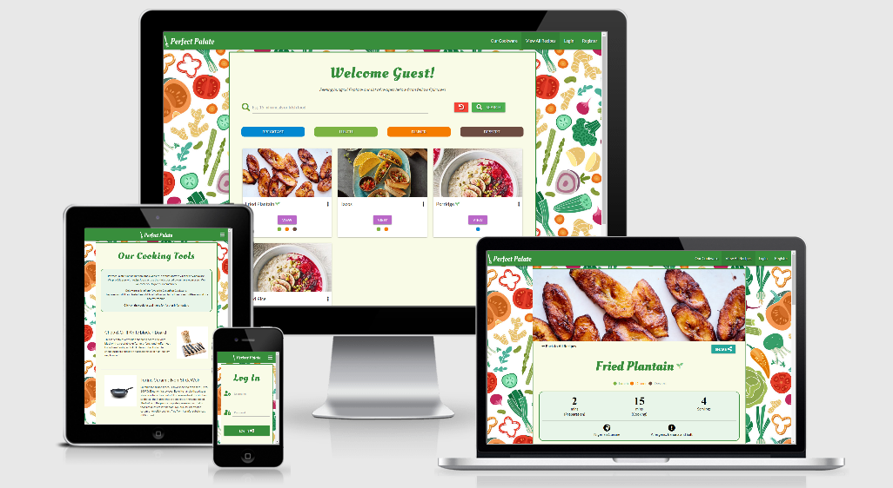
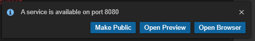

# Perfect Palate

Welcome to Perfect Palate - an online cookbook designed to host a collection of recipe ideas from across the globe. The website is primarily aimed at those that are open and willing to experiment other cultures in the comfort of their kitchen! With the pandemic lingering, what better way to spend your time than by challenging, educating and upskilling yourself in learning more recipes.

As part of the branding, Perfect Palate has partnered with GreenPan Cookware to promote top quality cooking tools to further enhance your cooking experience.

----------
Contents
-
- [Perfect Palate](#perfect-palate)
  * [1. User Experience - UX](#1-user-experience---ux)
    + [1.1. User Stories](#11-user-stories)
    + [1.2. Structure and Skeleton Phases](#12-structure-and-skeleton-phases)
  * [2. Features](#2-features)
    + [2.1. General Features](#21-general-features)
    + [2.2. CRUD Functionalities](#22-crud-functionalities)
    + [2.3. Special Features](#23-special-features)
    + [2.4. Features Left to Implement](#24-features-left-to-implement)
  * [3. Database Structure](#3-database-structure)
    + [3.1. Recipes Collection](#31-recipes-collection)
    + [3.2. Users Collection](#32-users-collection)
  * [4. Technologies Used](#4-technologies-used)
  * [5. Testing](#5-testing)
  * [6. Deployment](#6-deployment)
    + [6.1. Running Project Locally](#61-running-project-locally)
    + [6.2. Deployment to Heroku](#62-deployment-to-heroku)
    + [6.3. Differences between Development & Deployed Codes](#63-differences-between-development---deployed-codes)
  * [7. Credit](#7-credit)
    + [7.1. Content](#71-content)
    + [7.2. Acknowledgements](#72-acknowledgements)
    + [7.3. Disclaimer](#73-disclaimer)

------

## 1. User Experience - UX

### 1.1. User Stories

User Story 1:

>"As a Vegetarian, I would like to be able to see which meals are suitable for me or not."

User Story 2:

>"As a food-lover and promoter, I would like to be able to share recipes on my socials!"

User Story 3:

>"As a food newbie, I would like to learn how to cook something decent."

User Story 4:

>"As a health-conscious male, I would like to be informed of the contents and any possible allergies"

User Story 5:

>"As an epicure, I would like to be able to submit lots of my recipes without constraint, but keep track of how many I have added."

### 1.2. Structure and Skeleton Phases

These user requirements were traded off and aligned with the site owner goals of Perfect Palate to establish a clear project scope. After consultations with my mentor, I then drafted up wireframes for the website in both desktop and mobile versions.

I have compiled my wireframes in a single PDF in the [Project Development folder](https://github.com/jerhabor/perfect-palate/tree/master/static/wireframes).

## 2. Features

### 2.1. General Features

The colour theme is mainly green to subconsciously send the user an awareness of healthiness as they search through site. The site also favours vegetarians by signalling meals that are suitable for vegetarians.

Further general features as per the `base.html` template include:

**Favicon:**
- This icon consists of the fork icon from the Perfect Palate brand logo.

**Background:**
- Perfect Palate is all about food from various cultures. I wanted to reflect this in terms of colours and found it fitting to search for colourful yet greenery.

**Navigation Bar:**
- Both the web browser and the mobile side navigation bars use the following colours: `#fff` (white) and `#388e3c` (`.green` + `.darken-2` from Materialize). 
- For the web browser, the latter is used as the background and the former as the text colour. If menu item page is active, then the list item will have a darker green background: `#27662a`. 
- For the sidenav, the colours are reversed and the nav items use standard `#000` (black). 
- **Navigation Menu Items:**
    - If unregistered/guest: Our Cookware, View All Recipes, Login, Register.
    - If a registered user: Our Cookware, View All Recipes, Add Recipe, My Profile, Logout

**Card Panel:**
- All page main contents are always displayed within a `.card-panel` class with a clear background of `.lime` + `.lighten-5` from Materialize. This ensures that there is no interference with the colourful background but also maintains a warmer aura than a bare white background would have attempted to hold. 
- I used the Materialize `container` class on all main content for good structure and responsiveness across different devices and browsers.

**Footer:**
- Consistent colour scheme with the navigation bar.
- Perfect Palate's Cookware promotion of affiliation with GreenPan Cookware. A link is provided here to take user to the same page that the "Our Cookware" navigation bar item would take them to.
- Contact Block with the ability for the user to send an email straight away from their device by clicking on the email provided.
- Copyright
- Perfect Palate's social links (due to project created for educational purposes, the links only direct user to their respective homepages)

### 2.2. CRUD Functionalities

To fulfill the project needs, it is imperative that it addresses the CRUD functionalities which stands for Create, Read, Update and Delete. It gives the session user control on being able to find, submit, update and delete their own recipes at their request rather than just the ability to read recipes on a static page. 

**2.2.1. Create**

_**Add Recipe**_

This page is dedicated to achieving the create functionality. Here, the user is able to provide a significant amount of information about the recipe - as the form suggests. 
- The form inputs are all required apart from the YouTube video link (as not all recipes may be available on YouTube).
- To aid with good visual appeal, I have used font awesome icons as prefixes for all input elements.
- At the bottom of the page in the Allergens section, there is an educational element which helps ensure user is fully aware of the contents of their recipe.

**2.2.2. Read**

_**Search bar:**_
- The search index includes the recipe_name, recipe_by, cuisine_type, meal_time, cooking_time and description. Users can search for recipes submitted by a certain user by simply typing their name; the function will filter accordingly.
- The function uses the `GET` method so that it displays the search variable, `query` and keyword in the address bar. This allows for quick change to search by changing or adding keywords to url. This is however more advanced.
- It is important to note that Perfect Palate uses the default behaviour of a searching index, which is "OR" rather than "AND". 
- For example, searching for "irish porridge jesse" will filter all recipes that include any of those keywords in their recipe object.
- There are four buttons underneath the search bar namely the meal times: Breakfast, Lunch, Dinner and Dessert. These are all wired to the search bar.

_**Recipe Cards:**_
- The `.card-reveal` and `.activator` classes from Materialize allow users to click on the card and view a summary of the recipe before accessing the ingredients and method steps.
- View buttons are available to both users and non-users. 
- At the bottom of the cards there are dots which hold the same colours as the filter buttons below the search bar. Each card will have at least one dot colour as an indication of when the meal should be eaten. Tooltips are provided for labels of these dots.

_**Full Recipe Page:**_
- The cover header is magnifiable and can be viewed in full screen modal thanks to the `.materialboxed` class. This provides less pressure to fully fit adequately sized photos on the page without compromising its quality.
- If session user views their own recipe, an edit button will be available on this page just before Ingredients.
- I used numbers in style of font awesome icons as this is what users would prefer to see when reading the full recipe - information that is straight to the point.

**2.2.3. Update**

_**Edit Button:**_
- Each user can only see the edit button on cards of the recipes that they have created. 
- The button is also found on the _Full Recipe_ page and recipe cards on the _My Profile_ page.
- All buttons are wired to render the `edit_recipe` template explained below.

_**Edit Recipe Page:**_
- Flask and Jinja have enabled the page to pull, unpack and display data stored on the recipe by targeting the `recipe._id` in the `app.py` function.
- Upon submission, the user is redirected to the same page in the event that they wish to make more edits.

**2.2.4. Delete**

- The delete button is located at the bottom of the `edit_recipe` template in a danger zone. This is supposed to be a deterrent and encourage keeping recipes on the site.

### 2.3. Special Features

**'Our Cookware' Page:**
The main aim of this page was to promote the Perfect Palate + GreenPan cooking tools brand as per project specification.

### 2.4. Features Left to Implement

- **Favourite/Like Button** - The user who liked a card will find it displayed on their profile underneath their list of created recipes.

- **S3 Bucket** - Ability to upload images directly from device instead of using a host (e.g. IMGBB) or copying and pasting image addresses.

- **Carousel/Pagination for cards** - As the number of recipes created increase to minimize scrolling activity, pagination or use of a carousel would be an effective way to minimize that.

- **More Filters** - At the moment, the only filters are the search bar and the four meal time filter buttons. In the next version release, I would like to include filter for vegetarian options as well as sliders for preparation and cooking times.

- **Forgot Password** - I added the email address input field to the _Register_ template with the intention of creating a "Forgot Password" function - however this will also be available in the next release.

## 3. Database Structure

### 3.1. Recipes Collection

Below is a table showing the choice of data. Please note the asterisks which are explained after the table:

|     Data Key    | Data Type |
|:---------------:|:---------:|
|   cuisine_type  |   string  |
|   recipe_name   |   string  |
|    meal_time*   |   array   |
|   description   |   string  |
|     servings    |   string  |
| is_vegetarian** |   string  |
|    prep_time    |   string  |
|   cooking_time  |   string  |
|   ingredients   |   object  |
|      method     |   object  |
|    allergens    |   array   |
|      image      |   string  |
|      video      |   string  |
|    recipe_by    |   string  |

*The meal_time is composed of Breakfast, Lunch, Dinner and Dessert - out of which the user will be able to select. Some meals are suitable for more than one option e.g. rice could be eaten for Lunch and Dinner.

**It was much easier to store the is_vegetarian data as a string rather than a boolean due to the nature of the input. As a select form, the values of the select options were just equated to the value stored in the database rather than having to find a way to convert from string to boolean.

Exemplary storage of data for _Fried Plantain_:

```
{
    _id: 601003511615884e24186cf8
    cuisine_type: "Nigerian"
    recipe_name: "Fried Plantain"
    meal_time: Array
    description: "A very delicious global dish cooked wherever plantains grow."
    servings: "4"
    is_vegetarian: "Yes"
    prep_time: "2"
    cooking_time: "15"
    ingredients: Object
    method: Object
    allergens: Array
    image: "https://static01.nyt.com/images/2019/10/13/dining/kwr-maduros/kwr-madu..."
    video: "https://www.youtube.com/watch?v=sQJ9ioyNhEA"
    recipe_by: "jesse"
}
```

### 3.2. Users Collection

| Data Key | Data Type |
|:--------:|:---------:|
| username |   string  |
| password |   string  |
|  email*  |   string  |

*Email stored in preparation for the future implementation of the "Forgot Password" functionality.

## 4. Technologies Used

- [Git](https://git-scm.com/) - Perfect Palate used Git as the version control system during its development.
- [GitPod](https://www.gitpod.io/) - An online Integrated Development Environment (IDE) for writing and running code.
- [HTML5](https://en.wikipedia.org/wiki/HTML5) - HTML stands for Hypertext Markup Language and it is the backbone of Perfect Palate. The latest version (HTML5) - was used to add and structure the site content.
- [CSS3](https://en.wikipedia.org/wiki/Cascading_Style_Sheets) - CSS stands for Cascading Style Sheets. The latest version (CSS3) was used to style all HTML content on the website for enhanced structure and visual appeal.
- [Materialize CSS](https://materializecss.com/) - A UI component library with a grid system that Perfect Palate uses to layout site content in a structured fashion. The framework also provides some assistance to styling with class names.
- [Google Fonts](https://fonts.google.com/) - This font library offers a wide variety of font styles to help with the Perfect Palate's brand. This project uses Oleo and Lato fonts.
- [Font Awesome](https://fontawesome.com/) - Perfect Palate uses this icon library with its great selection of icons, to improve user experience (UX).
- [JavaScript](https://www.javascript.com) - onclick functionality to print full recipe or save as PDF.
- [JQuery](https://jquery.com/) - Perfect Palate uses the JQuery Framework in its script. It also assists Materialize functionalities by initializing them e.g. the loading of modal forms.
- [Python](https://www.python.org/) - General-purpose coding language used to render Perfect Palate's templates and run backend functionalities including wiring to database on MongoDB.
- [Flask](https://flask.palletsprojects.com/en/1.1.x/) - Micro-web framework written in Python. Perfect Palate uses this to write the python app functions and app routes.
- [Jinja](https://jinja.palletsprojects.com/en/2.11.x/) - A web template engine. Perfect Palate uses this to unpack the requested data retrieved from MongoDB in the HTML templates.
- [Pytest](https://docs.pytest.org/en/stable/) - Testing framework used for writing test codes in python to help refactor code in the Perfect Palate app.
- [Werkzeug](https://werkzeug.palletsprojects.com/en/1.0.x/) - Used to generate and check password hashes for extra security as user data is submitted to the database from the Perfect Palate Login and Register pages.
- [MongoDB](https://www.mongodb.com/) - A non-relational (NoSQL) source-available cross-platform document-oriented database program used to store data submitted from Perfect Palate. 
- [Balsamiq](https://balsamiq.com/) - Used to construct Perfect Palate's wireframes in the skeleton phase of UX.
- [MindMup](https://www.mindmup.com/) - Used to brainstorm ideas in the conceptual phase of Perfect Palate's project development.

## 5. Testing

The full documentation on testing can be found in [testing.md](https://github.com/jerhabor/perfect-palate/blob/master/testing.md).

## 6. Deployment

Perfect Palate is deployed to Heroku using its `master` branch; the only available branch at the moment.  
The deployed link is: [https://perfect-palate.herokuapp.com/](https://perfect-palate.herokuapp.com/).

### 6.1. Running Project Locally

1. Ensure that you have access to an Integrated Development Environment (IDE) e.g. Atom or GitPod.

2. You will need to ensure that this IDE has Git, PIP and Python 3 installed first. 

3. Clone the Perfect Palate GitHub repository by typing the following command on your CLI:
```
$ git clone https://github.com/jerhabor/perfect-palate.git
```

4. You will need to create an account on [MongoDB](https://www.mongodb.com/3) if you do not already have one.

5. Create an _env.py_ file which will store your *SECRET_KEY* variable and your *MONGO_URI* which is linked to your own database in MongoDB. The database name is *online_cookbook* with two collections namely _recipes_ and _users_.

6. Ensure that .gitignore is added to your IDE so that your env.py containing the data is never tracked/exposed.

7. You can now run the app on the terminal using the command:
    ```
    python3 app.py
    ```
    - Press *Open Browser* when prompted with:<br>
    <br>
    - Please note that this preview browser tab window will only work for as long as the app is running locally.

### 6.2. Deployment to Heroku

1. In order for the app to eventually be deployed by Heroku, you will need to tell Heroku what the required modules are. This can be easily achieved with the command:
    ```
    pip3 freeze --local > requirements.txt
    ```
2. You will then need to use the following command to create a Procfile which tells Heroku the file that will be running the app and how to do so:
    ```
    echo web: python app.py
    ```
    - Please note that sometimes the Procfile might have a blank line at the bottom which could cause issues in the app being run properly. Ensure that this extra blank line is deleted, then save the file.

3. Push both the requirements.txt file and Procfile to GitHub. When working in GitPod IDE, the process to push to the repository is as follows:
    ~~~
    $ git status
    $ git add (insert file name)
    $ git commit (insert file name if necessary) -m "(classify change and mention why changes were made for this version)"
    $ git push
    ~~~

    To track all files/add to storage area all at once, use instead:
    ~~~
    $ git add -A
    ~~~
4. On Heroku, click `Create a New App` and follow the instructions. 

5. Click `Deploy` tab then scroll to `Deployment method` and select GitHub. You will then be given the chance to confirm the GitHub repository to link with.

6. Now click `Settings`, scroll to `Config Vars` and click `Reveal Config Vars`. This is where you will need to enter data from `env.py`, without the quotation marks.

7. Go back to `Deploy` and scroll to `Manual Deployment`. Check that _Master_ branch is selected then deploy branch.

### 6.3. Differences between Development & Deployed Codes

- No longer using the Materialize collapsible/accordion as this does not bring as much visual appeal to the nature and intent of the site. Users would prefer to preview what they are about to click on, in order to best manage their interests.

- _Our Cookware_ now included as a navigation item as this is a high-priority requirement. On the project specification, the site owner requires a platform to promote cooking tools and the position of the item increases its likelihood of successful promotion - rather than just remaining in the page `footer`.

- No more "Click to view video" button as this meant the user would have to make two clicks. This also meant more code. The fact that not all recipes will have a video, reinforces that this function was not necessary and it is better to just display the video on the page if a user gave a YouTube link to one.

## 7. Credit
Software Developer: Jess Erhabor

### 7.1. Content

**7.1.1. Code Credit**

[Glyph, by Harry Roberts](https://css-tricks.com/examples/hrs/) - for the fancy horizontal rule.

[Supun Kavinda](https://blog.logrocket.com/styling-numbered-lists-with-css-counters/) - for the inspiration in styling the step numbers in the method section.

[Tim Nelson, Code Institute](https://github.com/TravelTimN) - for the styling of the validation class on the select option forms.

**7.1.2. Media Credit**

Generally, the images used for the recipe cards were sourced online e.g. google. It is worth noting that these were just used for educational purposes only.

### 7.2. Acknowledgements
- My mentor [Caleb Mbakwe](https://github.com/caleboau2012) - for his guidance from conception to deployment and testing.
- [Tim Nelson](https://github.com/TravelTimN) (Code Institute Course Tutor) - for his clear and concise lessons on Python, Flask, Jinja and MongoDB.
- My family - for testing the website and providing constructive feedback.
- The Slack community - for the open platform.

### 7.3. Disclaimer
This project was developed for educational purposes only.